# Kafka Streams Weather - Monitoring temps réel

Cette application **Kafka Streams** ingère des mesures météo (température, humidité) depuis un producteur, les enrichit puis les publie vers des topics dédiés et des cibles d'observabilité (Prometheus + Grafana).

---

## Fonctionnalités principales

1. **Ingestion & normalisation** : lecture d'un flux météo brut, harmonisation des unités et enrichissement par timestamp/ville.
2. **Filtrage & routage** : séparation température/humidité vers des sous-flux spécialisés.
3. **Persistences multiples** : exposition de métriques Prometheus et dashboards Grafana.
4. **Infrastructure Dockerisée** : Kafka, Prometheus et Grafana démarrés via `docker-compose`.

---

## Technologies utilisées

- **Java 17**
- **Kafka Streams**
- **Prometheus + Grafana**
- **Docker / Docker Compose**
- **Maven**

---

## Structure du projet
```text
tp-kafka-streams-weather/
├── src/main/java/ma/enset/WeatherStreamsApp.java
├── pom.xml
├── docker-compose.yaml
├── prometheus.yml
├── images/
│   ├── data-source.png
│   ├── pom-xml.png
│   ├── docker-compose.png
│   ├── docker-up.png
│   ├── docker-container.png
│   ├── run.png
│   ├── producer.png
│   ├── consumer.png
│   ├── prometheus-config.png
│   ├── prometheus-status.png
│   ├── temperature-metrics.png
│   ├── humidity-metrics.png
│   ├── grafana-dashboard.png
│   ├── visualization-1.png
│   └── visualization-2.png
└── README.md
```

---

## Configuration Maven (`pom.xml`)

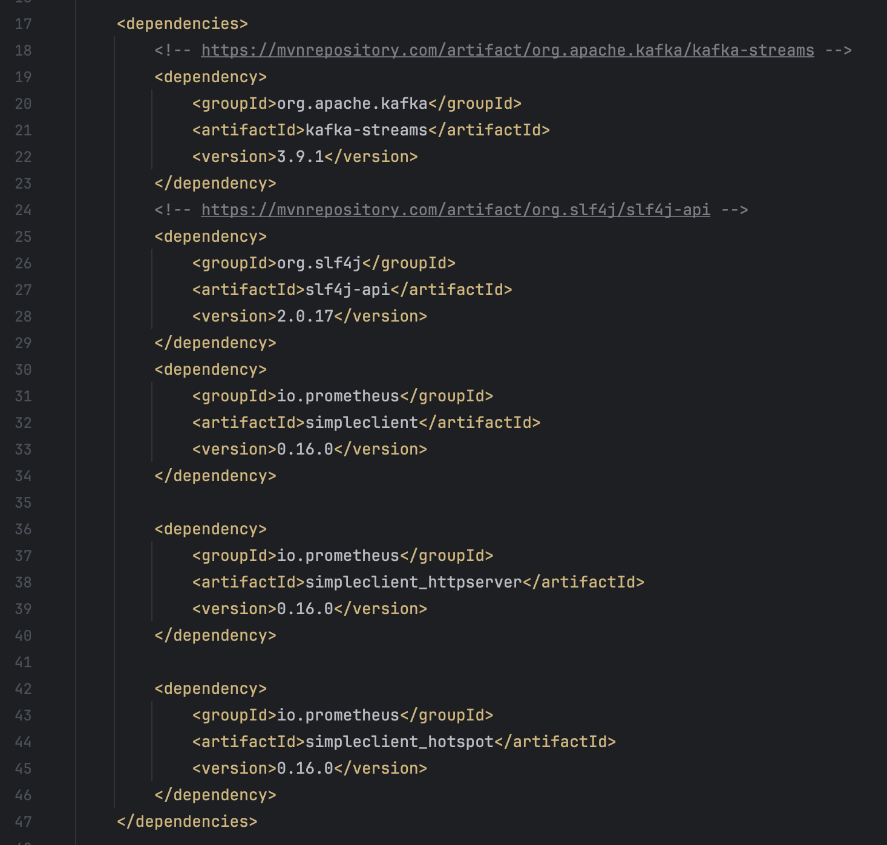

---

## Orchestration Docker (`docker-compose.yaml`)

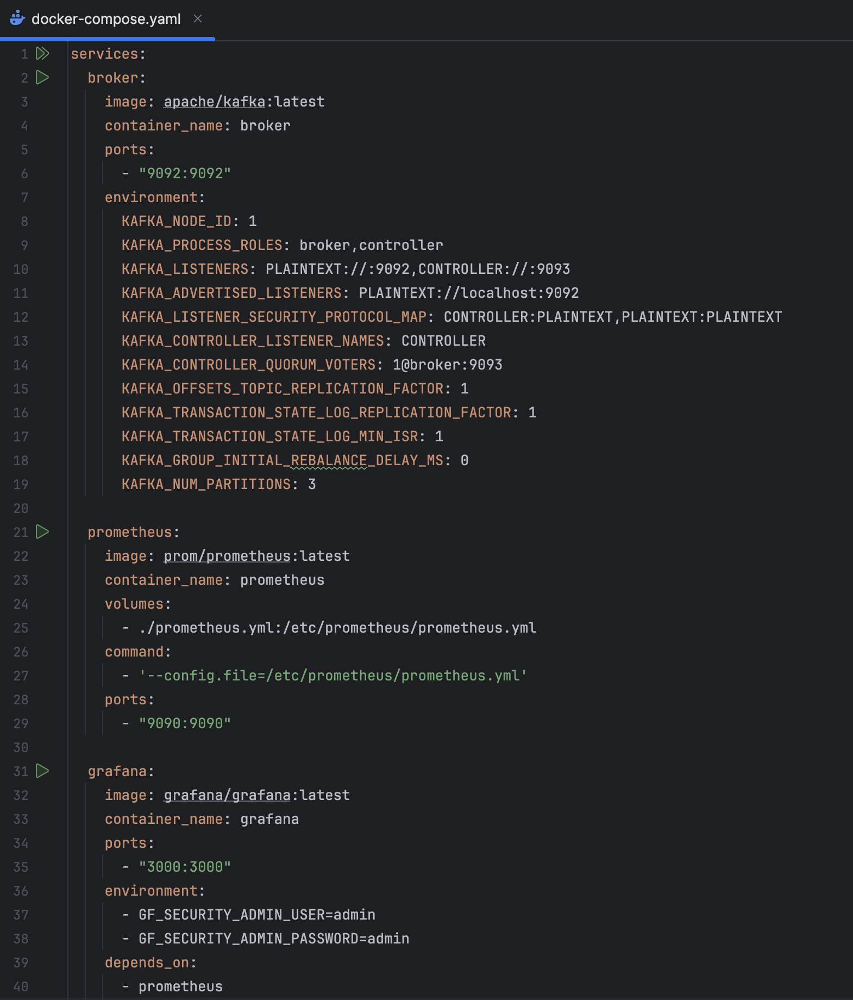

---

## Configuration Prometheus

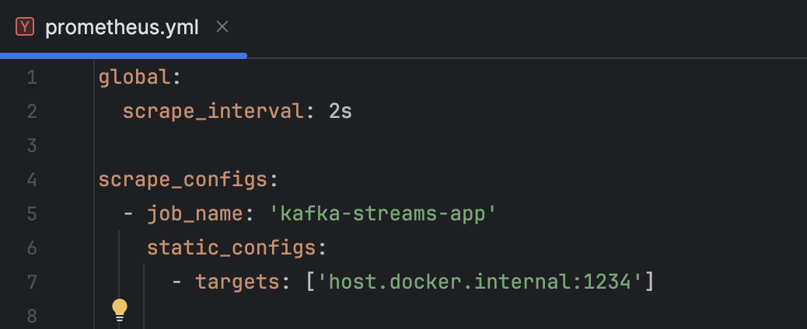

---

## Démarrage de l'infrastructure

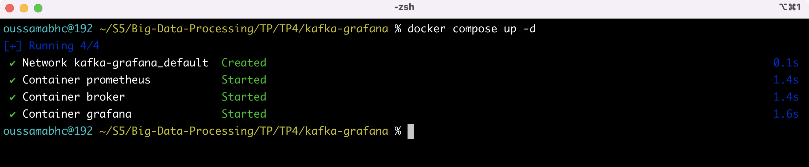

---

## Conteneurs opérationnels

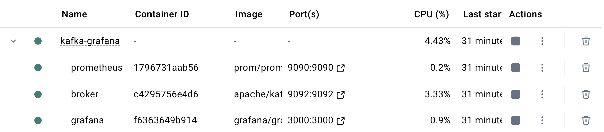

---

## Exécution de l'application Kafka Streams

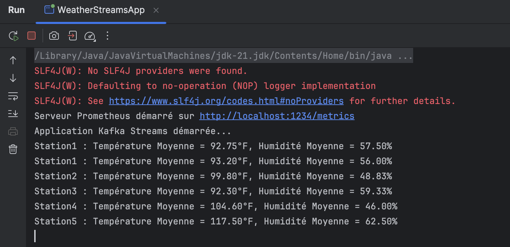

---

## Producteur de mesures

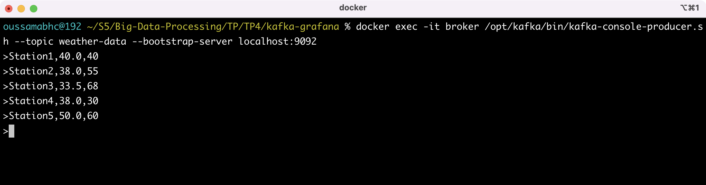

---

## Consommateur des flux nettoyés

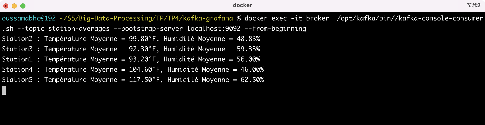

---

## Statut des cibles Prometheus

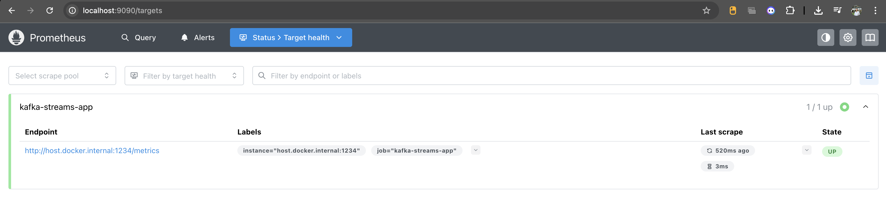

---

## Métriques humidité

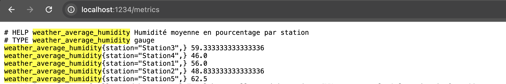

---

## Métriques température

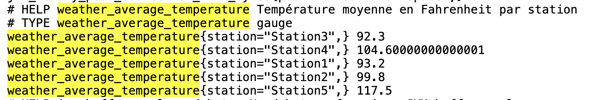

---

## Ajout de la data source Grafana


---

## Visualisations météo

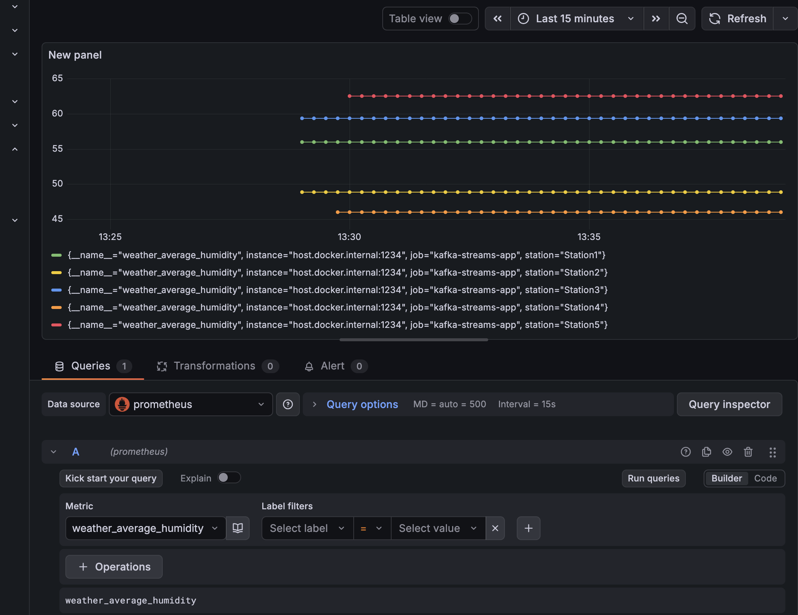


---

## Dashboard Grafana


---

## Aller plus loin

- Ajouter des alertes Prometheus pour détecter les dérives météo ou les pannes de pipeline.
- Automatiser le déploiement via un script `make` ou GitHub Actions pour reproduire l'environnement en un clic.
- Étendre l'application Kafka Streams avec un topic d'archives ou un stockage long terme (S3, Lakehouse, etc.).
